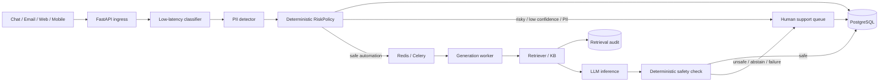

# Architecture

## 1. Цели и ограничения

Система должна одновременно удерживать скорость, безопасность и стоимость:

- около 5 млн активных пользователей;
- около 200k тикетов в день;
- incident burst 10–20k тикетов за 10 минут, то есть примерно 17–33 req/s;
- classification/routing на hot path — ориентир ≤ 500 ms;
- first response SLA — 15 минут;
- часть входа содержит PII;
- LLM может быть медленным или недоступным;
- автоматические решения должны быть аудируемыми.

Ключевой design decision: **LLM не принимает routing/risk decision и не блокирует приём тикета**.

## 2. Целевая схема



## 3. Поток данных

### Синхронный hot path

1. Канал нормализует обращение в canonical ticket.
2. FastAPI валидирует closed-set поля.
3. Classifier возвращает `category + confidence`.
4. PII detector проверяет текст.
5. `RiskPolicy` принимает deterministic решение.
6. `Ticket` и `Decision` сохраняются.
7. Human-route завершается без LLM; safe-route помещается в очередь.

На этом HTTP request заканчивается. Генерация ответа не входит в latency hot path.

### Асинхронный generation path

1. Worker получает `ticket_id`.
2. Загружает ticket из shared storage.
3. Retriever выбирает top-k knowledge documents.
4. `RetrievalResult` сохраняет rank/score/version для аудита.
5. При слабом retrieval ticket переводится человеку.
6. LLM генерирует ответ только из найденного контекста.
7. Safety checker проверяет PII, financial claims, prompt/routing leakage и abstention.
8. Safe answer сохраняется как `sent`; unsafe/failure переводит ticket человеку.

## 4. Human-in-the-loop и fallback

Human является не аварийным исключением, а нормальным route системы.

Прямой human-route:

- `payment`, `refund`, `security`;
- PII;
- classifier confidence ниже threshold.

Fallback после enqueue:

- retrieval context ниже threshold;
- generator abstain;
- LLM unavailable;
- unsafe generated response.

LLM outage поэтому не равен outage всей support-системы: приём, routing и операторская обработка остаются доступными.

## 5. Хранилища и аудит

### PostgreSQL

Целевой source of truth для:

- tickets;
- routing decisions;
- answers;
- retrieval results.

`Decision` хранит причину маршрутизации и версии classifier/policy. `RetrievalResult` отдельно хранит RAG audit, чтобы не смешивать бизнес-решение и retrieval telemetry.

### Redis

Используется как broker для async generation, а не как primary storage.

### Knowledge base

В PoC это JSON + TF-IDF index. В target architecture — versioned KB и semantic/vector retrieval.

## 6. Идемпотентность

На ingress используется `(channel, external_id)`.

- повтор того же payload возвращает существующий ticket;
- конфликтующий payload возвращает `409`;
- в SQL schema есть unique constraint.

Generation task рассчитан на at-least-once delivery: если ticket уже `resolved` или переведён `human`, повторный task не создаёт второй answer.

## 7. Clean Architecture

```text
infrastructure
     |
     v
  adapters
     |
     v
application
     |
     v
   domain
```

Domain/application не знают о FastAPI, Celery, Redis, SQLAlchemy, Qwen или Docker. Use cases зависят от ports, поэтому local adapters можно заменить distributed adapters без изменения бизнес-правил.

## 8. Что реально реализовано в PoC

- FastAPI ingress и API contracts;
- domain entities/policies;
- in-memory и SQLAlchemy repositories;
- local queue и Celery queue adapter;
- TF-IDF retriever;
- mock и Qwen generator adapters;
- deterministic safety checks;
- retrieval/decision audit;
- Docker Compose для API/PostgreSQL/Redis/Celery;
- optional Qwen Docker worker;
- tests и load-test script.

## 9. Что остаётся target design

В 4-часовой scope сознательно не входят:

- Kubernetes/multi-region;
- transactional outbox и полноценная DLQ strategy;
- production migrations;
- HA database/broker;
- semantic vector store;
- production classifier training pipeline;
- distributed tracing backend;
- operator UI.

Это не скрытые TODO, а осознанная граница PoC.
